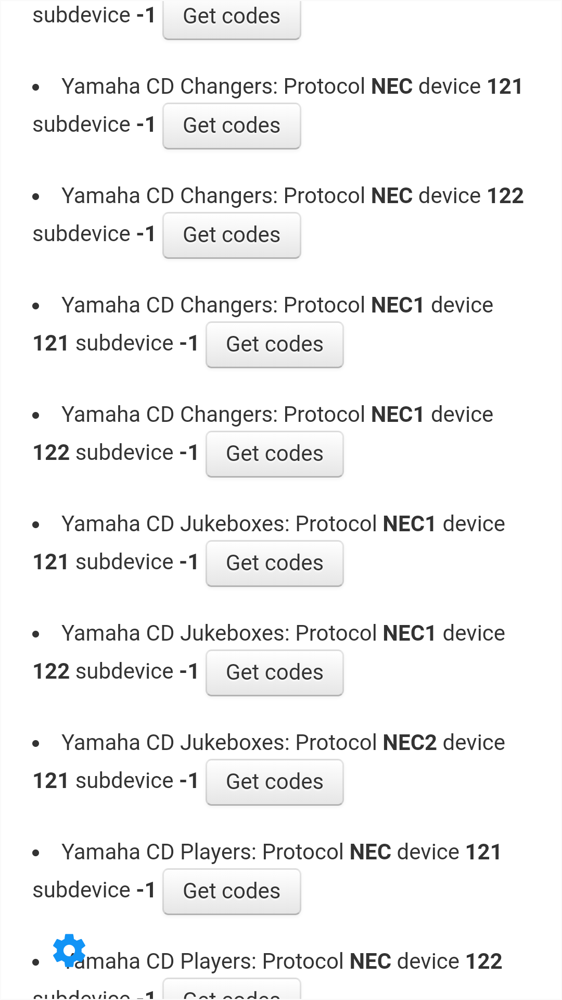
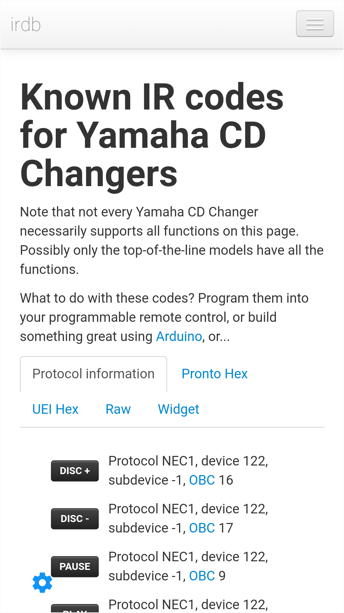
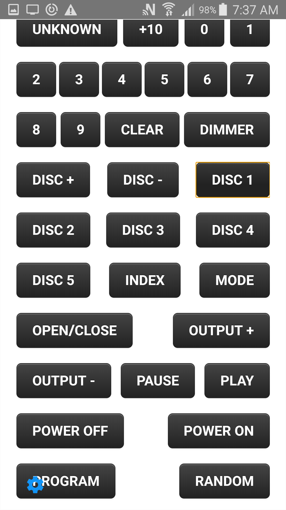

= DIYRemote Manual
Steve Hannah
:doctype: book
:encoding: utf-8
:lang: en
:toc: left
:numbered:

The "Do-it-Yourself" Remote Control for Android Devices

== Synopsis

The DIYRemote project allows you to design your own custom remote control interface for TV, Home theater, and any other devices that use an infrared remote control. You design your remote interface as a web page using standard HTML/CSS/Javascript, then open your web page in the DIYRemote app.  When your webpage is loaded inside the DIYRemote app, it will have access to a Javascript function `transmit()` which will transmit hex codes on the device's IR (Infrared) Emitter.

[#obtaining-device]
== Obtaining a Phone or Tablet with an IR Emitter

The bad news is that not all phones and tablets have an IR emitter.  The good news is that many older devices *do* include this feature, and can be obtained for *cheap* off of Craigslist, E-Bay, or Facebook Marketplace.

I'm not aware of any definitive lists of devices that have this feature, but it is common enough that I was able to just do a search on Craigslist for "Android phone", or "Samsung phone", etc.. with max price $75, and for each candidate, I just did a Google search for "Phone Model IR Blaster".  Generally the first result will be someone asking if that model has an IR blaster.  

E.g. I purchased a "Samsung Galaxy S5" off of E-Bay for 60CAD, which does have an IR emitter.  Doing a search on Google for "Samsung S5 IR Blaster" gave me my answer in the first result.

NOTE: The DIYRemote app requires Android 4 or higher, so it will work on very old hardware.

[#installing-diy-remote]
== Installing the DIY Remote App

Download https://github.com/DIYRemote/bin/DIYRemote.apk[DIYRemote.apk].

NOTE: You'll need to allow installation from untrusted sources.

[#getting-codes]
== Getting The Codes for Your Devices

The best resource that I have found for finding the codes for your devices is using the http://irdb.tk/[IRDB] website, which describes itself as:

> One of the largest crowd-sourced, manufacturer-independent databases of infrared remote control codes on the web, and aspiring to become the most comprehensive and most accurate one

You can browse this site and test the codes right inside the DIYRemote app.

. Open the DIYRemote App on your device
. Press the "Settings" button in the lower left corner, then click "Find Codes"
+
image::images/Image-210620-090332.294.png[width=480]
. Select the brand of the device you want to control, and press the "Get IR Codes" button
+
image::images/Image-210620-090436.646.png[width=480]
. Look through the list of results and see if there is one that looks "The Most" promising.  Press the "Get Codes" button corresponding to your choice.
+
NOTE: You might have to try a few different code sets before you find the right one.
+

. You'll see 5 tabs: "Protocol Information", "Pronto Hex", "UEI Hex", "Raw", and "Widget".  The most useful tabs here are "Pronto Hex" (which shows you the HEX codes to use for your `transmit()` call), and "Widget", which allows you to test the codes directly inside the DIYRemote app.
+

. Click on the "Widget" tab, then test out buttons until you find one that your device responds to.  If you find a button that works, make note of its name, then go to the "Pronto Hex" tab to get its Hex code.  If you don't find any buttons that work, then go back to the list of devices, and proceed down the list until you find one that works.
+

[#creating-html-page]
== Creating Your Remote Control Design

Creating your remote control design is as simple as building a web page.  There are no special requirements this web page, except, that you will need to trigger the `transmit()` function to trigger an IR code.  Here is a bare-bones remote control that just turns on and off a Sony Television.

.A basic remote control designed in HTML that powers on and off a Sony Television.
[source,html]
----
<!doctype html>
<html>
<body>
<h1>My First DIY Remote</h1>

This works for my Sony Television!!

<button onclick="transmit('0000 0068 0000 000D 0060 0018 0018 0018 0030 0018 0030 0018 0030 0018 0018 0018 0030 0018 0018 0018 0030 0018 0018 0018 0018 0018 0018 0018 0018 03F0')">
   Power On
</button>
<button onclick="transmit('0000 0068 0000 000D 0060 0018 0030 0018 0018 0018 0030 0018 0018 0018 0030 0018 0018 0018 0018 0018 0030 0018 0018 0018 0018 0018 0018 0018 0018 0408')">
   Power Off
</button>
</body>
</html>
</body>
</html>
----

NOTE: We call the `transmit()` function with the HEX codes we obtained from the <<getting-codes,Getting Codes Step>>.

After uploading this to your web server, you can open the DIYRemote app, press the "Settings" button in the lower left, and enter the URL to the webpage.  Then press Go.  Then you should be able to use your remote control.

== Uploading Your Remote Control

Since your remote control is just a regular webpage, you can host it anywhere you like.  If you already have a web server, you can post your remote control there.  If you don't have hosting, there are plenty of free hosting options available, including GitHub pages, JSFiddle, or Github Gist.

== Using your Remote Control

Once you have uploaded your remote control to your web server, open the DIYRemote app, press the "Settings" button in the lower-left corner of the screen, and enter the URL to your remote control page in the field, and press "Go".  This should display your custom remote control.  If you've correctly designed your page, and triggered the `transmit()` function with the correct codes, you should be able to control your devices using  your remote.

The DIYRemote app will always remember the last address that you loaded, and it will use this as the default remote control whenever the app is opened.

== Troubleshooting

If your remote control doesn't seem to work, then you should check the following likely suspects:

. If, when you call `transmit()` the app shows you a message saying that your device doesn't have an IR emitter, that means that your phone or tablet is not equipped with an IR emitter.  DIYRemote only works on Android devices that include such an emitter.  See <<obtaining-device>> for more information.
. If nothing happens when you click your remote buttons, you may have a Javascript error in the page that is preventing the page from initializing correctly.  The best way to debug this is to open your remote's webpage in Chrome or Firefox and open the Javascript console to look for errors.

== Pinning the App

If you intend to only use your device as a remote control, you can use the "App Pinning" feature of Android to convert it into a single-purpose device that runs your remote control all the time.  This saves the hassle of having to find and open your remote control whenever you go to use it. 

For instructions on pinning app screens, see https://support.google.com/android/answer/9455138?hl=en[this Google article on the topic].

== Sharing Your Remote Design

If you would like to share your remote control with the community so that other users who have the same devices can use your remote, please fork the DIYRemote Githu repository and add your remote control to the https://github.com/shannah/DIYRemote/tree/master/docs/remotes[docs/remotes] directory.  See the https://github.com/shannah/DIYRemote/tree/master/docs/remotes/AVR3600[AVR 3600 remote] as an example.  Additionally, you should add an entry to the https://github.com/shannah/DIYRemote/tree/master/docs/remotes.xml[remotes.xml] file.

Once you have added your remote, please send a pull request and I'll merge it into the master.

== Further Reading

. https://github.com/shannah/DIYRemote[DIYRemote Github Repository]

